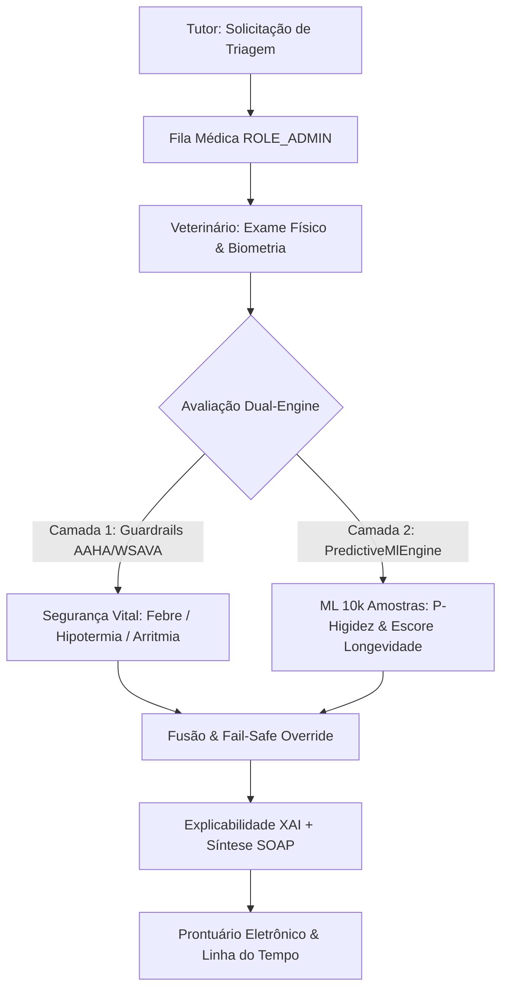
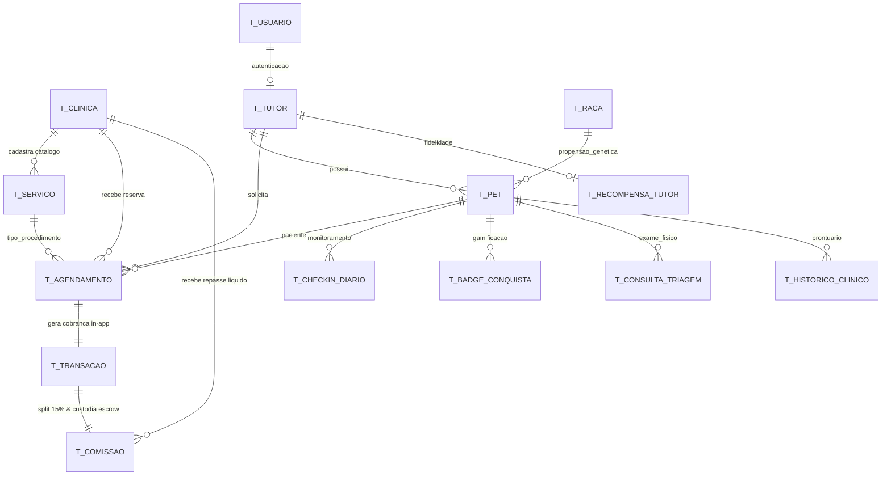

<div align="center">

# 🐾 Clyvo Vet Web v2
### **Evolução pós-entrega: perfil de produção, cadastro/recuperação de senha e login com Google**

[](https://www.oracle.com/java/)
[](https://spring.io/projects/spring-boot)
[](https://spring.io/projects/spring-security)
[](https://flywaydb.org/)
[](https://www.thymeleaf.org/)

<p align="center">
  <a href="#-sobre-o-projeto">Sobre</a> •
  <a href="#-como-executar">Como Executar</a> •
  <a href="#-autenticação">Autenticação</a> •
  <a href="#-login-com-google-oauth2">Login com Google</a> •
  <a href="#-perfis-de-execução">Perfis</a> •
  <a href="#-fluxos-de-negócio-completos">Fluxos</a> •
  <a href="#-testes-automatizados">Testes</a> •
  <a href="#-estrutura-do-projeto">Estrutura</a>
</p>

</div>

---

## 📖 Sobre o Projeto

Este repositório é a continuação do **Clyvo Vet** (entregue como projeto da 3ª Sprint de Java Advanced - FIAP) — uma
plataforma de medicina veterinária preventiva onde tutores fazem **check-ins diários** de seus pets (gerando streaks,
pontos e descontos reais) e veterinários avaliam uma **fila de triagem preditiva** que calcula um Escore de
Longevidade (0-100) cruzando idade, raça, sinais vitais e histórico de cuidados.

A entrega original (avaliada) permanece intocada em [`clyvo-vet-web`](https://github.com/Gabriel-Maciel06/clyvo-vet-web).
Este repositório evolui o mesmo código com três melhorias identificadas depois da entrega:

1. **Autocadastro e recuperação de senha** — antes só existiam os dois usuários do seed.
2. **Perfil de produção** — console H2, exceção de CSRF e credenciais de teste passam a existir *apenas* em
   desenvolvimento.
3. **Login e cadastro com Google (OAuth2)** — como alternativa ao usuário/senha local.

---

## 🚀 Como Executar

### Pré-requisitos
| Ferramenta | Versão |
| :--- | :--- |
| **JDK** | 21 |
| **Maven** | 3.8+ |

Nada além disso é obrigatório: o banco (H2 em memória) e as migrações do Flyway sobem sozinhos, e tanto o envio de
e-mail quanto o login com Google são **opcionais** — sem configurá-los, a aplicação funciona normalmente com login
local e a recuperação de senha registra o link no log em vez de enviar e-mail (ver [Autenticação](#-autenticação)).

### Passo a passo
```bash
git clone https://github.com/Gabriel-Maciel06/clyvo-vet-web-v2.git
cd clyvo-vet-web-v2

mvn test              # opcional: roda os 31 testes automatizados
mvn spring-boot:run   # sobe em http://localhost:8095
```

> Mais de um JDK instalado? Aponte o Maven para o 21 antes de rodar:
> `export JAVA_HOME=$(/usr/libexec/java_home -v 21)` (macOS) ou defina `JAVA_HOME` no Windows/Linux.

A porta muda com a variável `PORT` (ex.: `PORT=8080 mvn spring-boot:run`). O console H2 (apenas em desenvolvimento)
fica em `/h2-console` — JDBC URL `jdbc:h2:mem:clyvodb`, usuário `sa`, senha em branco.

### Credenciais do seed
| Perfil | Usuário | Senha |
| :--- | :--- | :--- |
| Veterinário (`ROLE_ADMIN`) | `admin` | `admin123` |
| Tutor (`ROLE_TUTOR`) | `tutor` | `tutor123` |

---

## 🔐 Autenticação

### Autocadastro de tutor
Tela `/cadastro` — cria, na mesma transação, a conta de acesso (`T_USUARIO`, senha em BCrypt) e o registro de tutor
(`T_TUTOR`). Sempre cria `ROLE_TUTOR`; contas de veterinário continuam existindo só via seed/administração direta,
por segurança. Valida CPF, e-mail e usuário duplicados (`UsuarioService.cadastrarTutor`).

### Recuperação de senha
Fluxo clássico de "esqueci minha senha", em `RecuperacaoSenhaService`:
1. `/recuperar-senha` recebe o e-mail e **sempre** responde a mesma mensagem, exista ou não a conta — evita que
   alguém descubra quais e-mails estão cadastrados.
2. Um token de uso único (UUID), válido por **30 minutos**, é salvo em `T_TOKEN_RECUPERACAO_SENHA` e enviado por
   e-mail com o link `/redefinir-senha?token=...`.
3. `/redefinir-senha` valida o token (não expirado, não usado) e troca a senha (BCrypt).

**Sem precisar configurar nada em desenvolvimento:** se as variáveis de e-mail não existirem, o Spring Boot não cria
o `JavaMailSender` e o `NotificacaoEmailService` registra o link no **log da aplicação** em vez de falhar — é assim
que este projeto foi testado. Para enviar e-mails de verdade, defina (ex.: com uma conta Gmail e uma
[senha de app](https://myaccount.google.com/apppasswords)):
```bash
export SPRING_MAIL_HOST=smtp.gmail.com
export SPRING_MAIL_PORT=587
export SPRING_MAIL_USERNAME=seu-email@gmail.com
export SPRING_MAIL_PASSWORD=sua-senha-de-app
```
Contas criadas via Google (ver abaixo) não têm senha local — pedir recuperação de senha para elas não gera token.

---

## 🌐 Login com Google (OAuth2)

Botão "Continuar com Google" na tela de login. **Só aparece quando configurado** — sem as variáveis de ambiente
abaixo, a aplicação sobe normalmente com login local apenas (nada quebra por falta de credenciais do Google).

### 1. Criar as credenciais no Google Cloud Console
1. Acesse [console.cloud.google.com](https://console.cloud.google.com/) e crie um projeto (ou use um existente).
2. Menu **APIs e Serviços → Tela de consentimento OAuth**: tipo *Externo*, preencha nome do app e e-mail; em
   *Escopos*, adicione `email`, `profile` e `openid`. Em desenvolvimento, adicione seu e-mail em *Usuários de teste*.
3. Menu **APIs e Serviços → Credenciais → Criar Credenciais → ID do cliente OAuth**:
   - Tipo de aplicativo: **Aplicativo da Web**.
   - **Origens JavaScript autorizadas:** `http://localhost:8095`
   - **URIs de redirecionamento autorizados:** `http://localhost:8095/login/oauth2/code/google`
     (em produção, troque pelo domínio real, ex.: `https://seu-dominio.com/login/oauth2/code/google`).
4. Copie o **Client ID** e o **Client Secret** gerados.

### 2. Configurar a aplicação
```bash
export GOOGLE_CLIENT_ID=seu-client-id.apps.googleusercontent.com
export GOOGLE_CLIENT_SECRET=seu-client-secret
mvn spring-boot:run
```
O botão do Google aparece na tela de login e `/oauth2/authorization/google` inicia o fluxo padrão do Spring Security.

### 3. O que acontece no primeiro login
`CustomOAuth2UserService` decide entre duas situações, a partir do e-mail devolvido pelo Google:
- **E-mail já tem conta local** (ex.: alguém que se cadastrou pelo formulário): a conta existente passa a aceitar
  login também via Google (o Google não substitui nem apaga a senha local).
- **E-mail novo:** cria `Usuario` (`ROLE_TUTOR`, sem senha) e `Tutor`. Como o Google não fornece CPF e ele é a chave
  primária de `T_TUTOR`, um **CPF provisório** é atribuído (`GOOGLE` + ID) e o tutor é levado a
  `/perfil/completar-cadastro`, onde informa o CPF e telefone reais antes de poder cadastrar pets
  (`PerfilService.completarCadastro`).

Essa lógica é validada por testes de unidade em `CustomOAuth2UserServiceTest` e `PerfilServiceTest`, sem depender de
credenciais reais — então o comportamento pode ser conferido com `mvn test` mesmo sem configurar o Google.

---

## 🏭 Perfis de Execução

| | Desenvolvimento (padrão) | Produção (`SPRING_PROFILES_ACTIVE=prod`) |
| :--- | :--- | :--- |
| Console H2 (`/h2-console`) | Habilitado | **Desabilitado** (nem exposto pela autoconfiguração) |
| Exceção de CSRF | Só para `/h2-console/**` | **Nenhuma** |
| Credenciais de teste na tela de login | Aparecem | **Ocultas** |
| Banco de dados | H2 em memória | Definido por `DB_URL`/`DB_USER`/`DB_PASSWORD`/`DB_DRIVER` |
| `spring.jpa.show-sql` | `true` | `false` |

```bash
export SPRING_PROFILES_ACTIVE=prod
export DB_URL=jdbc:oracle:thin:@//host:1521/SERVICE
export DB_USER=usuario_do_banco
export DB_PASSWORD=senha_do_banco
export APP_URL_BASE=https://seu-dominio.com   # usado nos links de e-mail
java -jar target/clyvo-vet-web-1.0.0.jar
```
A troca de perfil é feita inteiramente por `application-prod.properties` sobrescrevendo `application.properties` —
ver `SecurityConfig` (a flag `app.h2-console.permitir` decide, na mesma classe, se o console H2 é liberado *e* se a
exceção de CSRF existe, então em produção nenhum dos dois fica ativo).

---

## 👤 Controle de Acesso

| Perfil | Rotas |
| :--- | :--- |
| **Veterinário** (`ROLE_ADMIN`) | `/triagem/fila`, `/triagem/avaliar/{id}` |
| **Tutor** (`ROLE_TUTOR`) | `/pets/novo`, `/pets/salvar`, `/checkin/**`, `/triagem/solicitar`, `/perfil/**` |
| **Público** | `/login`, `/cadastro`, `/recuperar-senha`, `/redefinir-senha`, `/access-denied` |

Um tutor não acessa rotas de veterinário (e vice-versa) — recebe **403** e a página *Acesso Negado*. A camada de
serviço também impede que um tutor veja ou manipule **pets de outro tutor** trocando o ID na URL/formulário
(`PetService.validarPropriedade`).

---

## 🔄 Fluxos de Negócio Completos

### 🎮 Fluxo 1 — Check-in Diário, Streak e Recompensas (Tutor)
`CheckinController` → `CheckinService.registrarCheckin()`
1. Valida que o pet pertence ao tutor logado e que ainda não houve check-in hoje.
2. Detecta **alerta clínico** (humor apático/dor, pouco apetite ou sintomas descritos).
3. Pontua: 10 Clyvo Coins base, +5 com 30 min ou mais de atividade, +5 com medicação administrada.
4. Atualiza a **recompensa do tutor** (`RecompensaTutor`): streak, pontos, nível e desconto.
5. Desbloqueia **badges** e registra o evento na **linha do tempo clínica**.

| Nível | Critério (streak **ou** pontos) | Desconto |
| :--- | :--- | :---: |
| Bronze | padrão | 5% |
| Prata | 7 dias ou 100 pts | 10% |
| Ouro | 14 dias ou 250 pts | 15% |
| Diamante | 30 dias ou 500 pts | 20% |

### 🩺 Fluxo 2 — Triagem Preventiva e Longevidade (Arquitetura Dual-Engine: ML + Guardrails)
`TriagemController` → `TriagemService` → `PredictiveMlEngine`

O sistema implementa uma **Arquitetura de Decisão Híbrida (Dual-Engine Architecture)** com separação estrita entre segurança fisiológica vital e inferência estatística de longevidade:

1. **Camada 1: Guardrails Clínicos Determinísticos (Diretrizes AAHA / WSAVA):**
   - Regras médicas de emergência inegociáveis. Avalia hipertermia ($T > 39.3^\circ\text{C}$), hipotermia ($T < 37.8^\circ\text{C}$), taquicardia/bradicardia severa.
   - Atua como *fail-safe override*: parâmetros vitais críticos forçam imediatamente a classificação de risco elevado, impedindo falsos negativos de modelos estatísticos em emergências agudas.

2. **Camada 2: Motor de Machine Learning Probabilístico Multivariado (`PredictiveMlEngine`):**
   - Modelo calibrado sobre o **Canine Wellness Classification Dataset** (10.000 amostras clínicas, 21 features do Kaggle: `aaronisomaisom3/canine-wellness-dataset-synthetic-10k-samples`).
   - Métricas de Validação: **ROC-AUC: 0.9485**, **Acurácia: 87.24%**, **Recall: 94.92%**, **F1: 0.9169**.
   - Calcula a **Probabilidade Multivariada de Higidez $P(\text{Higidez} \mid \vec{x})$** via normalização Z-Score e função sigmóide logística $z = \beta_0 + \sum \beta_i \hat{x}_i$, ponderada por idade, peso/porte, sono, atividade aeróbica, visitas veterinárias e adesão profilática.
   - Computa o **Escore Preditivo de Longevidade (0 a 100)** e classificação de risco (`BAIXO`, `MODERADO`, `ALTO`).

3. **Camada 3: Explicabilidade Algorítmica (XAI / SHAP-like) & Síntese SOAP:**
   - Decompõe a inferência em vetores de atribuição de features (ex.: `[+14 pts Fase Adulta Jovem]`, `[+8 pts Consultas Regulares]`, `[-15 pts Predisposição Fenotípica]`).
   - Mapeia riscos específicos (displasia coxofemoral em grandes portes sem condroprotetor, estresse térmico em braquicefálicos).
   - Gera síntese clínica estruturada no padrão médico veterinário **SOAP** (Subjetivo, Objetivo, Avaliação, Plano) no prontuário.



---

### 🏬 Modelagem Relacional do Two-Sided Marketplace (14 Entidades em 3FN)

O ecossistema modela formalmente a intermediação entre tutores e clínicas credenciadas, superando prontuários isolados com transações in-app, split contábil e custódia (escrow):



1. **`T_CLINICA`**: Credenciamento B2B com CNPJ, Razão Social, CRMV do responsável, chave PIX de liquidação e taxa de comissão.
2. **`T_SERVICO`**: Catálogo de procedimentos profiláticos e preventivos de cada clínica com preço base, duração e elegibilidade a descontos.
3. **`T_AGENDAMENTO`**: Contrato de intermediação com status (`SOLICITADO`, `CONFIRMADO`, `REALIZADO`, `CANCELADO`).
4. **`T_TRANSACAO`**: Registro financeiro in-app retido pelo gateway (PIX/Cartão, abatimento de pontos, voucher e QR Code).
5. **`T_COMISSAO`**: Livro-razão contábil do split retendo os **15% de take-rate** na fonte em custódia (`RETIDO_ESCROW`) e liberando o repasse líquido após o atendimento (`LIBERADO_APOS_ATENDIMENTO` $\rightarrow$ `PAGO_LIQUIDADO`).

---

## 🧪 Testes Automatizados

```bash
mvn test   # 77 testes automatizados (100% aprovados)
```

| Classe | O que cobre |
| :--- | :--- |
| `ControleDeAcessoPorPerfilTest` | Login público, redirecionamento para `/login`, autenticação BCrypt, `403`/`200` por perfil. |
| `CadastroERecuperacaoSenhaTest` | Autocadastro (sucesso, senhas diferentes, username duplicado), recuperação de senha sem revelar e-mails existentes, token inválido. |
| `RecuperacaoSenhaServiceTest` | Geração de token, redefinição válida troca a senha (BCrypt), token expirado e token já usado são rejeitados. |
| `CustomOAuth2UserServiceTest` | Provisiona novo tutor via Google (CPF provisório, sem senha), vincula conta local existente pelo e-mail, login repetido não duplica conta. |
| `CustomUserDetailsServiceTest` | Conta local carrega normalmente; conta só-Google (sem senha) não quebra o login local — cai como "usuário não encontrado" em vez de estourar exceção. |
| `PerfilServiceTest` | Conclusão de cadastro troca o CPF provisório pelo real; não permite repetir a troca. |
| `CheckinServiceTest` | Pontuação, streak, alerta clínico, duplicidade e vínculo do pet com o tutor. |
| `TriagemServiceTest` | Triagem clínica fisiológica comparada: endodérmicos e ectotérmicos (répteis e peixes sem penalidade mamífera; aves com eutermia cloacal). |
| `PredictiveMlEngineTest` | Motor preditivo multivariado com modelos especializados: `CanineWellness`, `Ectothermic`, `Aquatic` e `Avian`. |
| `PetBiometriaValidacaoTest` | Validação biométrica estrita de limites de peso e idade por raça e formatação em gramas para pequenos animais. |
| `MarketplaceModelagemTest` | Ciclo completo do marketplace: catálogo, agendamento, split de 15% em escrow, validação de voucher e liquidação PIX. |

---

## 💻 Tecnologias
- **Java 21** · **Spring Boot 3.3.4** (Web MVC, Validation, Data JPA)
- **Spring Security 6** (form login, **OAuth2 Client** para Google, BCrypt, CSRF, roles)
- **Flyway** (10 migrações versionadas) · **H2** em memória, modo Oracle (driver `ojdbc11` incluído para troca de banco)
- **Spring Mail** (opcional — recuperação de senha)
- **Thymeleaf** + `thymeleaf-extras-springsecurity6` · **Bootstrap 5.3** + Bootstrap Icons
- **JUnit 5** + `spring-security-test` (MockMvc)

---

## 📁 Estrutura do Projeto
```
clyvo-vet-web-v2/
├── docs/                                        # Documentação herdada da entrega original
├── src/main/java/com/fiap/clyvovet/
│   ├── config/
│   │   ├── SecurityConfig.java                  # Autenticação local + OAuth2, perfis, CSRF condicional
│   │   ├── GoogleOAuth2Config.java               # ClientRegistrationRepository do Google (condicional)
│   │   └── OAuth2FeatureFlags.java               # Expõe se o login Google está habilitado
│   ├── controller/
│   │   ├── AuthController.java                   # /login, /cadastro, /recuperar-senha, /redefinir-senha
│   │   └── PerfilController.java                 # /perfil/completar-cadastro (tutores vindos do Google)
│   ├── dto/                                      # CadastroUsuarioDto, RecuperarSenhaDto, RedefinirSenhaDto...
│   ├── model/                                    # ProviderAutenticacao, TokenRecuperacaoSenha, ...
│   ├── repository/
│   └── service/
│       ├── UsuarioService.java                   # Autocadastro (Usuario + Tutor)
│       ├── RecuperacaoSenhaService.java          # Token, e-mail, redefinição
│       ├── NotificacaoEmailService.java          # Envio com fallback de log em dev
│       ├── CustomOAuth2UserService.java          # Provisionamento/vínculo via Google
│       └── PerfilService.java                    # Conclusão de cadastro (CPF provisório → real)
├── src/main/resources/
│   ├── application.properties                    # Perfil de desenvolvimento (padrão)
│   ├── application-prod.properties               # Perfil de produção
│   ├── db/migration/V1..V4__*.sql                # Flyway (V4 = login social + recuperação de senha)
│   └── templates/                                # + cadastro, recuperar-senha, redefinir-senha, completar-cadastro
├── src/test/java/com/fiap/clyvovet/
└── pom.xml
```

---

<div align="center">
  <sub>Evolução do Clyvo Vet além da entrega da 3ª Sprint de Java Advanced — FIAP.</sub>
</div>
