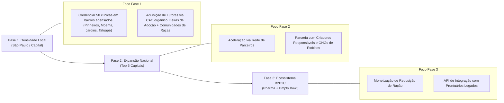

# 📊 Pesquisa de Mercado Estratégica: Clyvo Vet
**Setor:** Pet Tech · Saúde Preventiva & Longevidade Animal · Two-Sided Marketplace  
**Data de Consolidação:** Setembro de 2026  
**Fontes Primárias:** Abempet (Associação Brasileira das Empresas do Setor de Animais de Estimação / Fusão Abinpet & IPB), Grand View Research, PitchBook, Morgan Stanley Pet Industry Report, FDA Veterinary Innovation.

---

## 1. Sumário Executivo & Tese de Investimento

O mercado pet global e brasileiro vive uma transformação estrutural sem precedentes: a transição definitiva da **medicina curativa reativa** (hospitalizações emergenciais de alto custo) para a **medicina preventiva baseada em dados e longevidade**.

O **Clyvo Vet** posiciona-se no cruzamento de três forças de mercado de alto crescimento:
1. **Humanização dos Animais ("Pet Parenting"):** Mais de 70% dos tutores consideram seus animais como membros da família ou filhos, com elasticidade de preço significativamente reduzida para cuidados de saúde e bem-estar.
2. **Ociosidade nas Clínicas Veterinárias Independentes:** Clínicas de pequeno e médio porte enfrentam taxas de vacância de salas de atendimento entre **40% e 55%** em dias úteis, operando com margens comprimidas pela inflação de insumos.
3. **Emergência da "Pet Longevity Tech":** A consolidação global de startups que associam monitoramento longitudinal, inteligência artificial preditiva e fidelização de longo prazo (como *Loyal* nos EUA e *Lassie* na Europa).

**A Tese do Clyvo Vet:** Ao transformar o acompanhamento rotineiro do pet em uma experiência diária de 30 segundos (micro-check-ins gamificados com recompensas) conectada a um motor de triagem clínica híbrida (CDSS), a plataforma canaliza a demanda preventiva diretamente para a capacidade ociosa de clínicas credenciadas, monetizando via take-rate de 15% com liquidação garantida em Escrow.

---

## 2. Dimensionamento de Mercado (TAM, SAM, SOM)

### 2.1 Panorama Geral do Mercado Brasileiro
* O Brasil consolidou-se como o **3º maior mercado pet do mundo** em faturamento, superado apenas por Estados Unidos e China.
* **Evolução do Faturamento no Brasil:**
  * **2024:** R$ 75,4 bilhões (+9,6% de crescimento anual).
  * **2025:** R$ 77,96 bilhões (+3,45%, reflexo do ajuste macroeconômico e cautela tributária).
  * **2026 (Projeção Abempet):** Retomada com faturamento superior a **R$ 80,0 bilhões**.
* **Composição do Mercado Brasileiro:**
  * *Pet Food (Nutrição):* 53,5% (~R$ 42,8 bi).
  * *Venda de Animais:* 11,0% (~R$ 8,8 bi).
  * *Produtos Veterinários (Pet Vet):* 10,5% (~R$ 8,4 bi).
  * *Serviços Veterinários (Consultas, Exames, Cirurgias):* **10,2% (~R$ 8,16 bi)**.
  * *Pet Care (Higiene, Estética, Acessórios):* 14,8% (~R$ 11,84 bi).
* **População Pet no Brasil:** Mais de **160 milhões de animais**:
  * ~60 milhões de cães.
  * ~30 milhões de gatos (segmento que mais cresce, +6% ao ano).
  * ~42 milhões de aves ornamentais.
  * ~22 milhões de peixes ornamentais.
  * ~6 milhões de pequenos mamíferos e répteis.

```
       ┌────────────────────────────────────────────────────────┐
       │ TAM: Mercado Total de Serviços & Saúde Vet (Brasil)   │
       │ R$ 16,56 Bilhões (Serviços Veterinários + Farma Vet)   │
       └───────────────────────────┬────────────────────────────┘
                                   │
                                   ▼
              ┌───────────────────────────────────────────────┐
              │ SAM: Clínicas Privadas & Tutores Digitalizados│
              │ em Regiões Metropolitanas (SP, RJ, PR, MG, RS)│
              │ R$ 3,80 Bilhões / ano                         │
              └───────────────────────┬───────────────────────┘
                                      │
                                      ▼
                         ┌─────────────────────────────┐
                         │ SOM: Meta de Captura Clyvo  │
                         │ (1% a 2,5% do SAM em 3 anos)│
                         │ GMV: R$ 38 a 95 Milhões/ano │
                         │ Receita Líquida (Take-Rate): │
                         │ R$ 5,7 a 14,25 Milhões/ano  │
                         └─────────────────────────────┘
```

---

## 3. Análise de Tendências Globais & Macro-Drivers

### 3.1 A Revolução da Longevidade Animal (Pet Longevity)
Historicamente, o mercado veterinário atuava sob o modelo de **bombeiro** (apagar incêndios quando a crise clínica se manifesta). Startups internacionais comprovaram que a longevidade é o novo Santo Graal da indústria:
* **Loyal (EUA):** Startup de biotecnologia voltada à extensão de vida canina que captou mais de US$ 125M e obteve marco regulatório inédito do FDA (Center for Veterinary Medicine) validando o conceito de fármaco antienvelhecimento para cães.
* **Lassie (Suécia/Alemanha/França):** Seguradora pet preventiva que remunera tutores com descontos quando eles completam cursos e check-ins diários de prevenção no app. Apresenta churn 60% menor que seguradoras tradicionais.
* **Modern Animal (EUA):** Rede de clínicas tech-enabled focada em experiência híbrida (app de triagem + consultório presencial), com valuation superior a US$ 1 bilhão.

### 3.2 Expansão das Espécies Não-Convencionais (Exóticos)
No Brasil, o crescimento de tutores de aves (calopsitas, canários), répteis e roedores supera 15% ao ano, impulsionado pela verticalização urbana (apartamentos menores onde cães de grande porte não cabem). 
* **Vácuo de Atendimento:** Praticamente **zero** planos de saúde pet no Brasil cobrem animais não-convencionais. O Clyvo Vet preenche essa lacuna com seu motor taxonômico de 10 estratégias.

---

## 4. Mapeamento Competitivo & Benchmarking

| Dimensão de Análise | Softwares de Gestão (SimplesVet, VetSoft) | Planos de Saúde Pet (Petlove Saúde, Dog Life) | Grandes Redes / Varejo (Petz, Cobasi) | Clyvo Vet Web v2 |
| :--- | :--- | :--- | :--- | :--- |
| **Proposta Central** | ERP, estoque, agendamento e emissão fiscal para clínica. | Convênio médico tradicional com mensalidade fixa. | Varejo de rações, farmácia e estética. | **Marketplace de Longevidade, Split e Triagem Clínica (CDSS).** |
| **Engajamento do Tutor** | Nulo (o tutor não usa o sistema; é software interno da clínica). | Baixo a Médio (usado apenas ao solicitar autorização ou reembolso). | Médio (compras esporádicas de reposição). | **Altíssimo (Micro-check-ins diários de 30s + gamificação e streaks).** |
| **Inteligência Clínica** | Prontuário estático sem predição. | Regras rígidas de carência e glosas de cobertura. | Recomendações comerciais de produtos de prateleira. | **CDSS Híbrido com XAI (ML 10k amostras ROC 0.9485 + 9 espécies zoológicas).** |
| **Modelo de Receita** | SaaS B2B mensal (R$ 150 a R$ 600/mês da clínica). | Mensalidade B2C (R$ 90 a R$ 350/mês por pet). | Margem bruta sobre venda de mercadorias. | **Take-Rate de 15% sobre consultas + split com voucher anti-fuga.** |
| **Relação com a Clínica** | Fornecedor de software operacional. | Tensão alta (valores de tabela baixos, glosas e retenção de pagamentos). | Concorrente direto (hospitais próprios das redes). | **Parceiro de ocupação (Yield Management): preenche salas ociosas sem mensalidade fixa.** |
| **Suporte Multi-Espécie** | Apenas campos abertos de texto. | Restrito quase exclusivamente a cães e gatos. | Focado em cães e gatos (aves/peixes apenas para venda de ração). | **Nativo para 9 classes taxonômicas com fisiologia comparada.** |

---

## 5. Personas & Segmentação de Mercado

### Persona B2C: A Tutora Hiperconectada ("Pet Mom")
* **Nome:** Camila Albuquerque, 31 anos, Gerente de Marketing.
* **Perfil:** Tutora de um Golden Retriever (Thor, 5 anos) e uma gata resgatada (Mia, 2 anos). Mora em apartamento em São Paulo.
* **Dores:** Medo constante de descobrir doenças tarde demais; falta de tempo para preencher prontuários longos; desconfiança de clínicas desconhecidas; preços imprevisíveis de emergências.
* **Ganhos com o Clyvo Vet:** Rotina de check-in de 30 segundos; acompanhamento da pontuação de longevidade de Thor; descontos reais conquistados com fidelidade; agendamento transparente com voucher digital.

### Persona B2B: O Proprietário de Clínica Veterinária Independente
* **Nome:** Dr. Roberto Martins (CRMV-SP), 44 anos.
* **Perfil:** Proprietário de clínica de bairro com 3 consultórios e centro cirúrgico básico.
* **Dores:** Salas ociosas às terças e quartas-feiras pela manhã; custo de aquisição de novos clientes (CAC) inviável no Google Ads; dependência excessiva de emergências noturnas; inadimplência em cheques/fiado.
* **Ganhos com o Clyvo Vet:** Ocupação de horários ociosos com tutores qualificados e pré-triados; recebimento garantido em Escrow com liquidação no D+3 via PIX/Cartão; zero custo fixo de adesão (risco zero).

---

## 6. Análise SWOT (Matriz FOFA)

### Forças (Strengths)
* **Arquitetura Técnica de Classe Mundial:** Backend robusto em Java 21 / Spring Boot 3.3.4, com livro-razão financeiro em 3FN e 102 testes automatizados.
* **IA Confiável e Defensável (Sem AI-Washing):** Modelo de ML calibrado com ROC-AUC de 0.9485 aliado a guardrails de emergência vitais (AAHA/WSAVA) que garantem a segurança do paciente.
* **Mecanismo Anti-Fuga de Plataforma:** Voucher digital com QR Hash único e custódia em Escrow que protege a monetização de 15% de take-rate.
* **Multi-Espécies Real:** Algoritmos dedicados para 9 espécies (de cães a répteis e tarântulas).

### Oportunidades (Opportunities)
* **Preenchimento de Capacidade Ociosa (Yield Management):** Modelo análogo ao Gympass/Wellhub, oferecendo preços dinâmicos em horários de menor movimento da clínica.
* **Venda Preditiva de Insumos (Empty Bowl Alert):** Integração com pet shops para reposição de ração no dia exato do esgotamento via check-ins alimentares.
* **Monetização de Dados Anonimizados para Indústria Farmacêutica:** Insights epidemiológicos longitudinais de raças e espécies exóticas.

### Fraquezas (Weaknesses)
* **Desafio Clássico de Marketplace (Problema do Ovo e da Galinha):** Necessidade de balancear a densidade geográfica de clínicas credenciadas com o volume de tutores ativos em uma mesma região.
* **Dependência de Adoção Cultural:** Exige que clínicas veterinárias adotem o leitor de voucher digital no balcão para baixa da consulta.

### Ameaças (Threats)
* **Consolidação das Mega-Redes:** Expansão de grandes grupos de hospitais veterinários próprios (como a rede Seres da Petz).
* **Carga Tributária:** Possíveis impactos de novas alíquotas de serviços sobre plataformas intermediadoras de pagamentos.

---

## 7. Estratégia de Go-to-Market (GTM) & Canais de Tração



### Estratégia de Ativação em 3 Etapas:
1. **Fase 1 — Densidade de Bairro (Cluster Strategy):**
   * Em vez de dispersar o aplicativo em todo o Brasil, concentrar a ativação em 3 clusters metropolitanos de alta renda pet em São Paulo (Moema/Vila Mariana, Pinheiros/Perdizes, Tatuapé/Anália Franco).
   * Meta: 40 a 50 clínicas credenciadas e 3.000 tutores ativos nos primeiros 6 meses, garantindo tempo máximo de deslocamento de 15 minutos para qualquer tutor.
2. **Fase 2 — Parcerias com Especialistas de Exóticos:**
   * Veterinários de aves, répteis e silvestres sofrem com escassez de plataformas que reconheçam a particularidade do seu paciente. O Clyvo Vet atuará como a plataforma preferencial das associações zoológicas (ABRAVAS/ARAV).
3. **Fase 3 — Monetização de Ecossistema (Beyond Consultations):**
   * Ativação do *Empty Bowl Alert* para reposição automática de alimentos premium e medicamentos contínuos com split de faturamento direto com pet shops locais.

---

## 8. Conclusão & Próximos Passos
O **Clyvo Vet** não compete com os veterinários; ele os abastece com clientes pré-educados para a prevenção. Ao unir uma **suíte tecnológica de ponta (Java 21, Spring Boot 3, Multi-Gateway Stripe/Mercado Pago)** a um **modelo de negócios sustentável com take-rate co-financiado**, a plataforma posiciona-se como candidata natural à liderança na nova onda de Pet Techs da América Latina.
